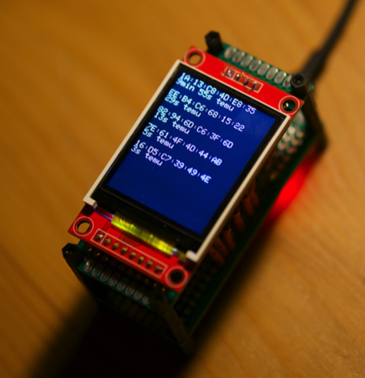

# Station sniffer for hardcoded network BSSIDs & channels
This project is a packet sniffer. It works in promiscous mode and sniffs for packages sent between a device and a selected network router. 
Next, it shows list of most recently seen network stations and prints time when the last packet has been seen.

This replaces a need to run Kismet in order to observe network users appearance. No password needed!

# Kudos
This work is based on screen libraries modifications for BW16 provided by 
https://github.com/dkyazzentwatwa

# How to change selected BSSIDs & channels in the code
## BSSIDs
Wel, first you need to learn what is the BSSID of the Access Point you want to observe. You can use any network scanner to obtain it.

Please note order of bssids and channels does not need to be in sync, but of course these networks need to exist on any of the listed channels. 

Next, you need to add leading 0x before each of the 6 comma-separated elements and put them in the array.

See lines 30-32. There is a 2-dimensional array called 'target'. It contains examples of BSSIDs.
 
  { 0xAA, 0xBB, 0xCC, 0xDD, 0xEE, 0xFF },  
  { 0xA1, 0xB1, 0xC1, 0xD1, 0xE1, 0xF1 }

You can add more BSSIDs and change them. 

## Channels
Below, in line 37 is a way simpler array with channels that should be observed. 

uint8_t channels[2] = { 11, 44 };

Just enter channel numbers here. Sniffer will jump between these channels periodically.

# How to build
In order to compile this code, you need to replace 3 libraries: BusIO, GFX and SSD1306.
## How to get the libraries:
Check out these 3 directories:
https://github.com/dkyazzentwatwa/cypher-5G-deauther/tree/main/RTL8720DN_SSD1306_FIX 
## Where to put the libraries
Copy them into your home_directory/Documents/Arduino/libraries

## Warning 
After you copy the libraries, do NOT let ArduinoIDE to upgrade them until you have the working code on your board.

# How to wire
| TFT Screen        | RTL8720DN (BW16) |
|-------------------|------|
| SDA (MOSI)       | PA12 |
| A0 (Data/Command)| PB2  |
| RESET            | PB1  |
| CS (Chip Select) | PA15 |
| SCK (Serial clock)| PA14 |
| GND              | GND  |
| 3V3              | 3V3  |

# Pictures

